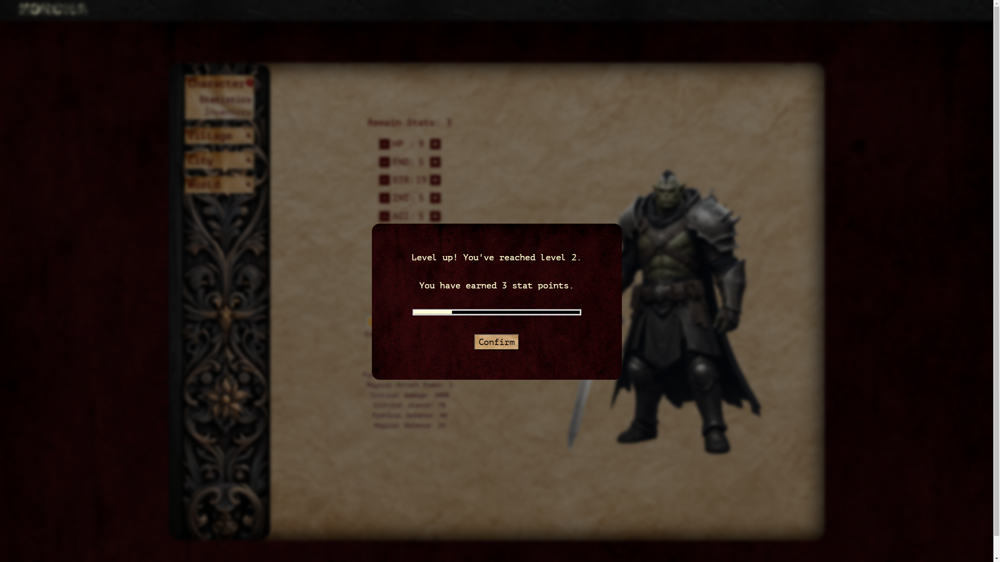

# React + Vite

Korcha is an old-school turn-based browser game which I developed after I started learning React. It consists of around 100 components. The project was important for me to understand the basics of React, such as useState, useEffect hooks, props, reusable components, React Router, etc. Since it was developed right after I started learning React, it does not have proper state management and has a lot of prop drilling. As soon as I have time from my other projects, I plan to implement proper state management using useReducer and Context or Redux. However, this project was essential for me to understand the fundamentals.

<a href="https://korcha-game.vercel.app/">LIVE</a>

  
  
  
  
  
  
  
  

